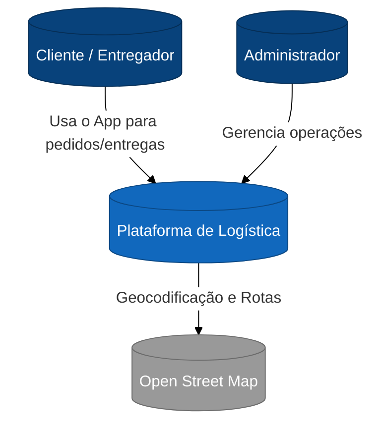
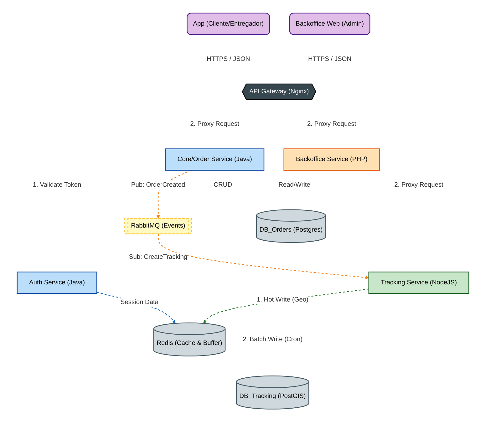
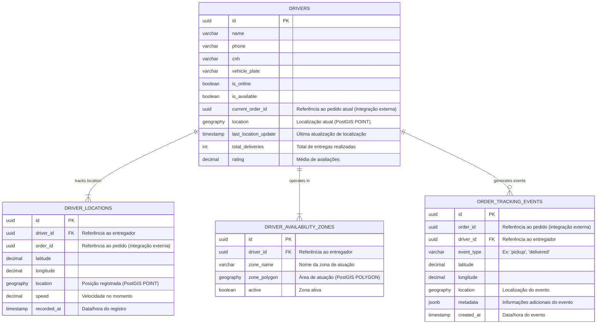
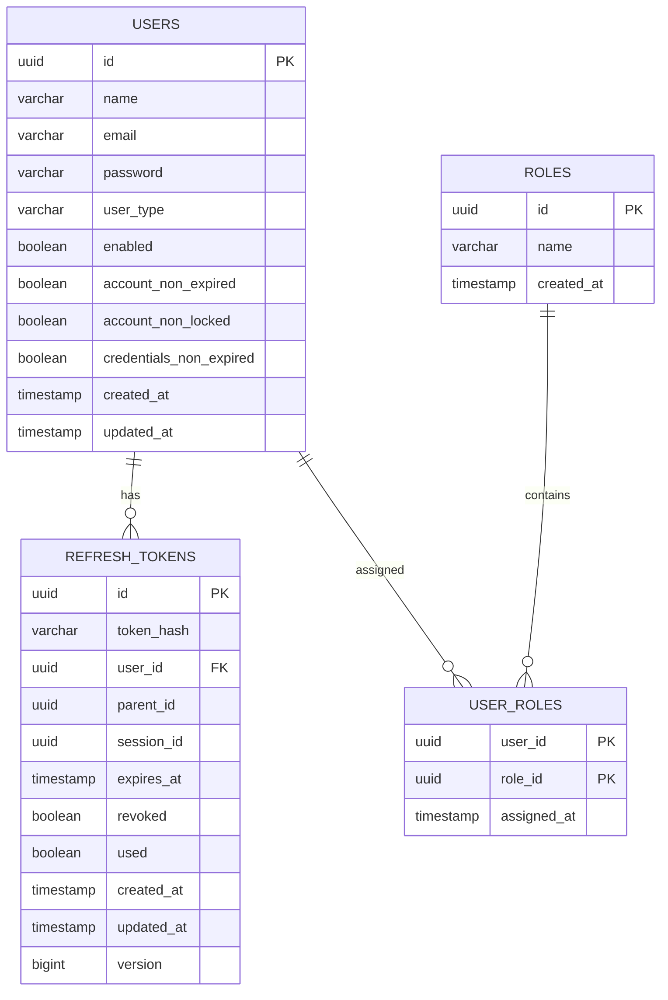
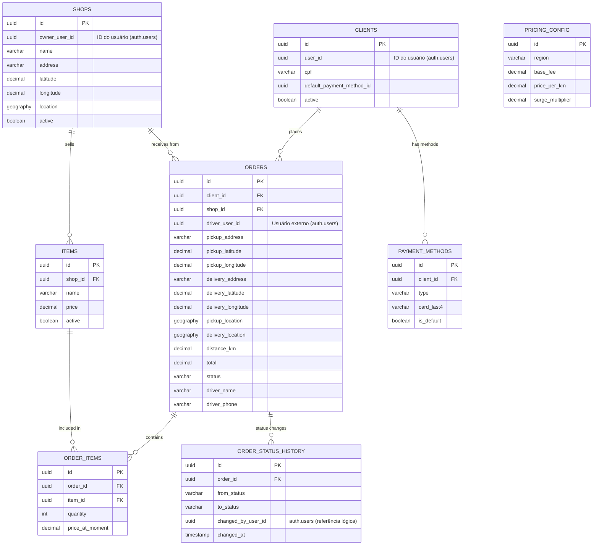

# 🏗️ Arquitetura do Sistema - Plataforma Logística

Este documento detalha as decisões de arquitetura, stack tecnológico e estratégias de dados adotadas para o desenvolvimento da plataforma de entregas.

## 1. Contexto do Sistema (C4 Model - Nível 1)

Visão macro das interações entre os usuários, a plataforma e sistemas externos.

## 2. Arquitetura Técnica (C4 Model - Nível 2)

O sistema segue uma arquitetura de Microsserviços orientada a eventos.
O fluxo de dados prioriza:

### Segurança no edge (API Gateway)

### Performance na escrita de geolocalização (Write-Behind)

## 3. Stack Tecnológico

A escolha segue Polyglot Programming, usando a melhor ferramenta para cada responsabilidade.

### Componentes, Tecnologias e Responsabilidades

| Componente       | Tecnologia           | Responsabilidade                                  |
| :--------------- | :------------------- | :------------------------------------------------ |
| API Gateway      | Nginx                | Roteamento, SSL, Rate Limiting                    |
| Auth Service     | Java (Spring Boot)   | Autenticação e JWT                                |
| Core Service     | Java (Spring Boot)   | Pedidos e pagamentos                              |
| Tracking Service | Node.js (NestJS)     | Telemetria e geo-cálculos                         |
| Backoffice       | PHP                  | Administração e relatórios                        |
| Bancos           | PostgreSQL + PostGIS | Dados relacionais e espaciais                     |
| Cache/Buffer     | Redis                | Cache, geolocalização em tempo real, write-behind |
| Mensageria       | RabbitMQ             | Comunicação assíncrona                            |

## 4. Decisões Estratégicas (Key Design Decisions)

### 4.1. Autenticação Centralizada (Gateway Offloading)

**Decisão:** O Nginx (ou API Gateway) valida o token JWT via sub-request (`auth_request`) antes de encaminhar para os microsserviços.

**Benefício:** Os serviços internos (`fleet-orders`, `fleet-tracking`) não precisam implementar lógica de validação de token, focando apenas no domínio. Permite revogação centralizada e simplifica a gestão de dependências de segurança.

### 4.2. Telemetria em Alta Frequência (Write-Behind Pattern)

**Problema:** Milhares de coordenadas de entregadores chegando a cada 3 segundos gerariam gargalo de I/O se fossem inseridas linha a linha no banco.

**Solução:**

- **Entrada:** O serviço de Tracking grava no Redis (Geo Set/Lists) para latência sub-milissegundo.
- **Buffer:** O Redis atua como um buffer temporário de alta velocidade.
- **Persistência:** Um Cron Job (Worker) coleta esses dados e faz Batch Inserts no PostGIS a cada 60 segundos.

### 4.3. Consistência Eventual e Confiabilidade (Transactional Outbox)

**Problema:** O risco de "Dual Write" (salvar no banco e falhar ao enviar para o RabbitMQ).

**Solução:** Implementação do **Transactional Outbox Pattern** no `fleet-auth`. O evento é salvo na mesma transação do banco de dados e um polling publisher garante o envio para o RabbitMQ, assegurando que nenhuma mensagem de negócio seja perdida em caso de falha de rede.

## 5. Modelagem de Dados

### db_fleet_tracking

> Modelagem voltada para rastreamento de entregadores, eventos e zonas de atuação. Utiliza PostGIS para dados espaciais e integrações com o serviço de pedidos via UUID.

### db_fleet_orders

> Modelagem voltada para pedidos, clientes, lojas e histórico de status. Integração com rastreamento via UUID, snapshots para auditoria e campos explicativos.

#### auth_schema

---

#### orders_schema

## 6. ADR – Registros de Decisões Arquiteturais

### ADR 001: Processamento da Localização do Entregador

**Decisão:** Utilizar processamento em lote (Batch Work) com Redis e PostGIS.

**Justificativa:** O volume de escrita de GPS é alto demais para o banco relacional suportar em tempo real (OLTP). O processamento em lote reduz a carga de I/O no disco e evita locks desnecessários na tabela de histórico.

### ADR 002: Mensageria (RabbitMQ vs Kafka)

**Decisão:** Adotar RabbitMQ.

**Justificativa:** Para o estágio atual e volumetria do `fleet-auth` e notificações, o RabbitMQ oferece menor complexidade operacional, suporte nativo a prioridade e roteamento flexível (exchanges), além de garantir confirmação granular de entrega (ACKs). O Kafka seria overkill e adicionaria complexidade acidental neste momento.

### ADR 003: Separação de Bancos de Dados

**Decisão:** Utilizar bases de dados fisicamente separadas para Domínios distintos (`db_fleet_auth`, `db_fleet_orders`, `db_fleet_tracking`).

**Justificativa:**

- **Isolamento de Falhas:** Um pico de carga no rastreamento não derruba o login dos usuários.
- **Segurança:** Dados sensíveis (senhas) ficam inacessíveis ao serviço de pedidos.
- **Escalabilidade:** Permite escalar o hardware do banco de geolocalização (PostGIS) independentemente do banco relacional padrão.

### ADR 004: Garantia de Entrega (Idempotência)

**Decisão:** Consumidores devem ser Idempotentes.

**Justificativa:** Devido ao uso do Outbox Pattern e à natureza de redes distribuídas ("at-least-once delivery"), mensagens podem chegar duplicadas. Os serviços consumidores utilizam tabelas de controle ou chaves de negócio únicas para descartar duplicatas silenciosamente.

## 7. Trade-offs (Limitações Aceitas)

- **Consistência Eventual no Histórico:** O trajeto do entregador pode levar até 60 segundos para aparecer no histórico permanente (PostGIS), embora a posição atual (Redis) seja em tempo real.

- **Dependência Crítica do Redis:** Se o Redis falhar e não houver persistência em disco (AOF/RDB) configurada, pode haver perda de até 1 minuto de dados de telemetria (buffer).

- **Complexidade de Observabilidade:** Com a separação em microsserviços e bancos distintos, o rastreamento de erros exige ferramentas de Distributed Tracing (OpenTelemetry/Micrometer) para correlacionar logs entre Java, Node.js e banco de dados.

- **Integridade Referencial:** A separação dos bancos remove as Foreign Keys entre Pedidos e Usuários, exigindo que a consistência seja garantida via aplicação (eventos de compensação).
